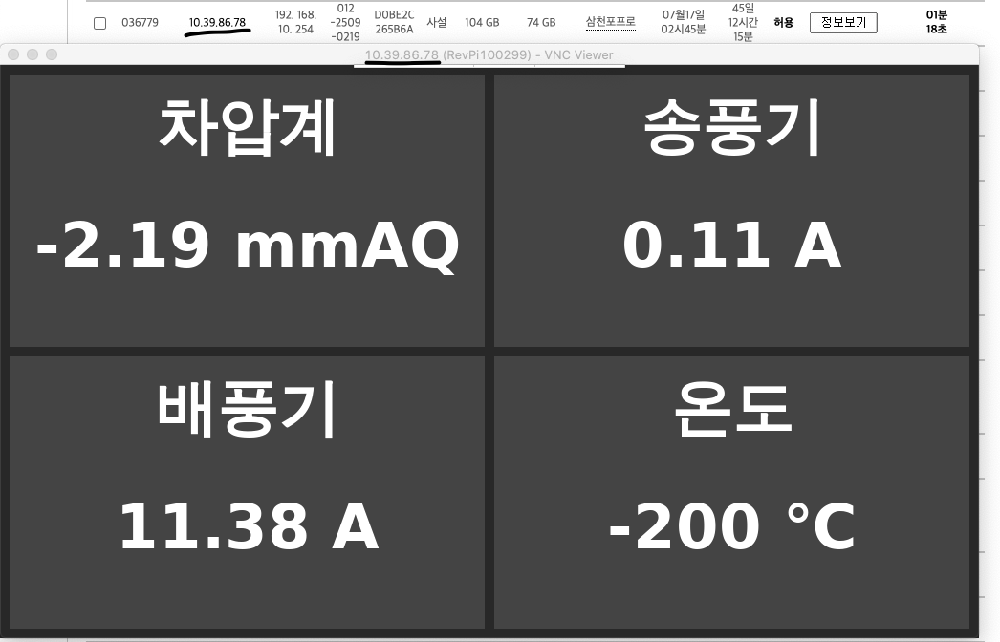
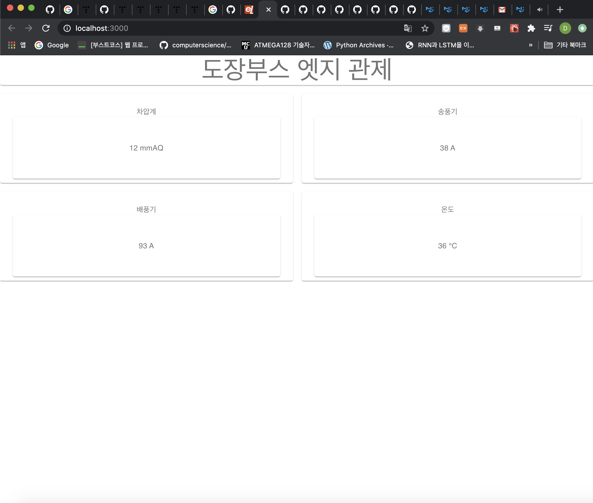

# 환경셋업 방법

`$pip install -r requirements.txt`   

혹은  

`$python3 -m pip install -r requirements.txt`  

상기 명령어를 이용하여 필요한 패키지를 설치한다.

# 실제 동작



실제 greengrass Lambda 화 해서 IoT서비스로 배포한 화면 (로컬에서 코드 설치후 사용도 가능)

* 실제 동작은 Revolution Pi라는 산업용 라즈베리 파이로부터 실제 센서 데이터를 입력 받는다.

```python3
import revpimodio2
```

* revpimodio2라는 라이브러리가 이 센서 데이터를 쉽게 접근하도록 도와준다. (그렇지 않으면 IOCTL을 직접 접근해야 함 -> Linux)

```python3
def singleton(cls):
    instances = {}
    def getinstance():
        if cls not in instances:
            instances[cls] = cls()
        return instances[cls]
    return getinstance

@singleton
class RevolutionPi:

    def __init__(self):
        self.profile_path = DIR #revpi edge path
        self._profile = get_profile(self.profile_path)
        self.image_path = self._profile.get("IMGPATH")
        self.sensor_profile = self._profile.get("sensor_list")
        self.normalization_profile = self._profile.get("data_information")
        self.sampling_time = 0.02 #20ms
        self.before_buffer = []
        self.after_buffer = []
        self.rev = revpimodio2.RevPiModIO(autorefresh = True, procimg = self.image_path)
        self.rev.cycletime = 1000
        self.IO = self.rev.io
```

* revolution pi 라는 클래스를 생성, 생성될 때 profile 데이터를 저장한 경로와, 그 외 실제 revpimodio2를 쓰기위한 설정을 함.


# 웹서버 실행 방법
`$python3 test.py`
`$python3 main.py` -> 실제 revolution pi 상에서만.

웹브러우저 상에서 127.0.0.1:9999 로 접속 가능

# 구조

## 웹서버 측

`python 코드`

```python3
@socketio.on('request', namespace='/data')
def push_values(msg):
    emit('rtdata', {'data':making_number()})
```

flask에서는 socketio를 통해 'request'라는 주제로, '/data' 네임스페이스에 요청이 들어오면  
socketio로 다시 emit하고, 주제는 'rtdata'이다. 데이터는 random.randint로 보내는 중.

## 클라이언트 측

`javascript 코드`

```javascript

var binder = io("http://localhost:9999/data");
setInterval(function() {
  binder.emit('request', {'time': Date.now()});
}, 1000);

setInterval( function() {
binder.on('rtdata', function(data) {
  console.log('binder buffered: ', data)
  var target = document.getElementById('data_1')
  var target_2 = document.getElementById('data_2')
  var target_3 = document.getElementById('data_3')
  var target_4 = document.getElementById('data_4')
  console.log(target)
  target.innerHTML = data.data[0] + '\nmmAQ'
  target_2.innerHTML = data.data[1] + '\nA'
  target_3.innerHTML = data.data[2] + '\nA'
  target_4.innerHTML = data.data[3] + '\n℃'
});} ,1000);

```

socketio javascript로 구성되어있다. index.html 참고 -> TODO: CDN이 아닌 로컬에 socketio 관련 js 파일 배포 필요. (Done)

binder라는 변수로 socketio, 네임스페이스는 '/data' 를 할당.

`setInterval` 함수를 이용해 1초마다, '/data'네임스페이스의 'request' 라는 주제로 emit(전송)

웹서버 측은 1초마다 request 주제로 받게되고, 이에 따른 동작으로 'rtdata'라는 이름으로 클라이언트에 전송

client는 다시 `binder.on('rtdata', function().....` 으로 'rtdata 주제로 데이터를 수신중이며,

웹서버에서 보낸 'rtdata' 주제가 들어왔을 때 #value_1 id를 셀렉트해 HTML마크업을 1초마다 변경하게 된다.

`TODO` : 현재는 socketio로 받은 실시간 변화하는 값을, document.querySeletor를 이용해 태그 id 선택 후  
  
.innerHTML 에 실시간 변화하는 값을 넣어서 구현 -> 더 나은 방법 찾아보기

# 실제 앱 동작

`$python3 main.py` 를 이용해서 웹서버를 구동하면 된다. 

`revolution pi` 의 경우 `/etc/xdg/lxsession/LXDE-pi/autostart` 파일을 아래와 같이 수정한다.

```shell
#!/bin/bash
@/usr/local/bin/python3 ${main.py가 있는 경로}/main.py
@/usr/bin/chromium-browser --kiosk http://127.0.0.1:9999
```

그 외 필요한 것들

`$sudo apt-get install -y chromium-browser ibus-hangul fonts-unfonts-core`


## 기존 HTML + JS 뷰에서 React 뷰로 변경

`material ui` 활용 하여 구현.



